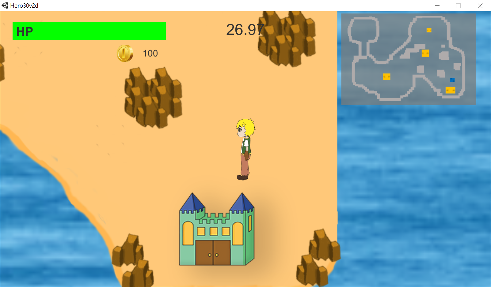
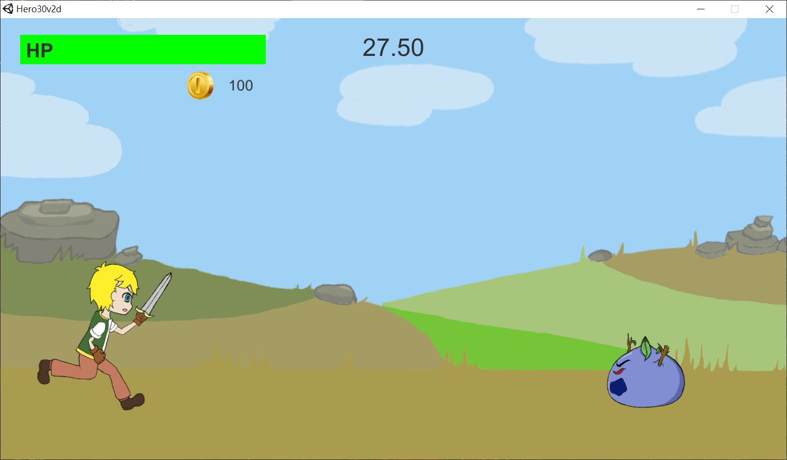
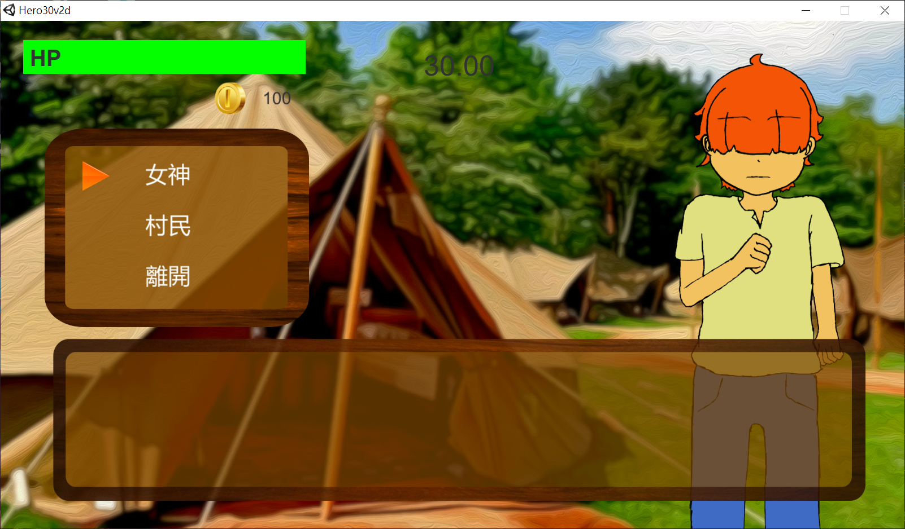

# Hero30 (30秒拯救世界)

> A Hero need to save the world in 30 Seconds
>
> if Hero can not save the world in 30 seconds. Game Over and Do it Again and Again.
>
> Hero need to finish some request and find the reason why this world only have 30 seconds life.
>
> Hero need to go to village reset time when time became less and less also recover HP.
>

## Game Information
> Game Genre: RPG
>
> Platform: Windows

## Game Instruction
> Arrow key --- control Hero in map
>
> 'A' button --- Attack monster
>
> 'C' button --- Confirm
>
> 'D' button --- Escape in battle scene

## Game sreenshots

## Remarks
> All audio source: Asset Store and google search
>
> explosion effect :Asset Store 
>
> village background : google search
